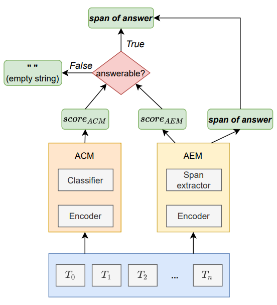
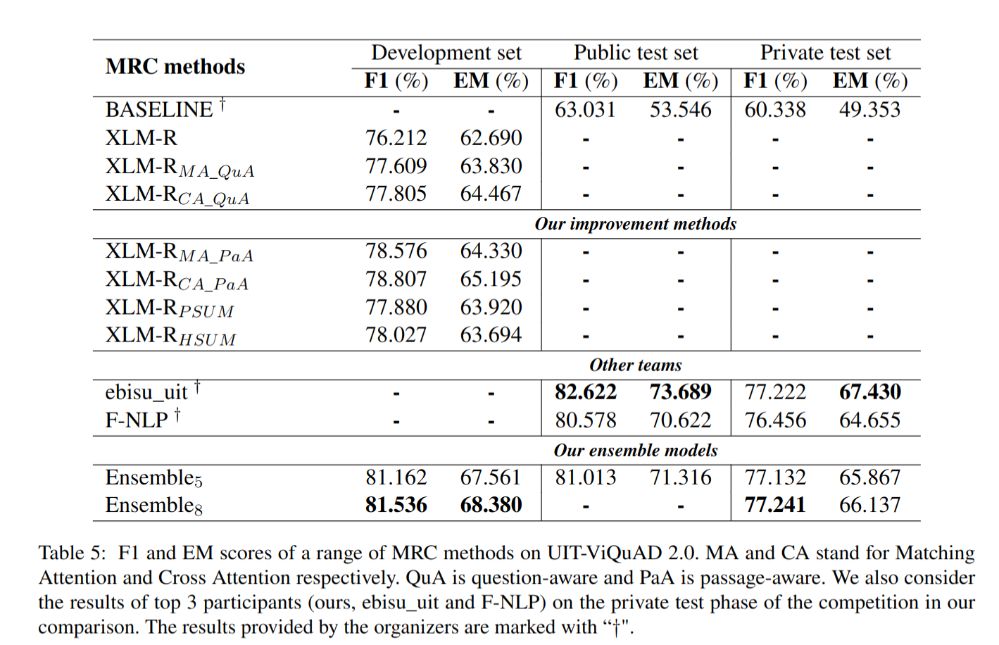

# ViMRC-VLSP 2021: Improving Retrospective Reader for Vietnamese Machine Reading Comprehension
*1st place in the Machine Reading Comprehension at VLSP 2021*

This repository contains code for the vc-tus team in the [VLSP2021](https://vlsp.org.vn/vlsp2021) competition of Machine Reading Comprehension Shared Task. Our team achieves the **1st rank** in the competition. More detail about task description, dataset, and ranking scores is provided in [VLSP_MRC](https://jcsce.vnu.edu.vn/index.php/jcsce/article/view/340). 

## Table of content
- [Contributions](#contributions)
- [Methodology](#methodology)
- [Experimental results](#experiment-results)
- [Leader board](#leader-board)
- [Citation](#citation)
- [Contact us](#contact-us)

## Contributions

1. This work introduces a more **appropriate way to apply attention mechanism variants** and utilize **layer aggregation** techniques to improve Retro-Reader and apply it to Vietnamese MRC.

2. We present an **ensemble approach** to achieve outstanding results.

3. Experiments show that our methods can yield substantial improvements to Retro-Reader and attain the **1st rank** in VLSP2021-MRC Shared Task.

## Methodology

We use two modules in our MRC system. 

- A classifier module is used to **determine whether a question is answerable** when giving a passage, called Answerability Classification Module (ACM).

- Answer Extraction Module (AEM) aims to **extract the answer** from the passage.

<p align="center">
  
</p>

## Experimental results

<p align="center">
  
</p>

## Leader board

* Public test

|  Rank       | Team        | F1           | EM           |
|:------------|:------------|-------------:|-------------:|
|             | Human       | 87.335       | 81.818       | 
| 1           | NLP_HUST    | **84.236**   | 77.728       |
| 2           | NTQ         | 84.089       | **77.990**   |
| 3           | ebisu_uit   | 82.622       | 73.698       |
| 4           | Our team    | 81.013       | 71.316       |

* Private test

|  Rank       | Team        | F1           | EM           |
|:------------|:------------|-------------:|-------------:|
|             | Human       | 82.849       | 75.500       | 
| 1           | Our team    | **77.241**   | 66.137       |
| 2           | ebisu_uit   | 77.222       | **67.430**   |
| 3           | F-NLP       | 76.456       | 64.655       |


## Citation
More details can be found in our [paper](https://jcsce.vnu.edu.vn/index.php/jcsce/article/view/346).

If you're using ALV in your research or applications, please cite using this BibTeX:
```bibtex
@article{nam2022vimrc,
  title={ViMRC-VLSP 2021: Improving Retrospective Reader for Vietnamese Machine Reading Comprehension},
  author={Nam, Le Hai and Duc, Nguyen Sy and Quan, Chu Quoc and Van Vi, Ngo},
  journal={VNU Journal of Science: Computer Science and Communication Engineering},
  volume={38},
  number={2},
  year={2022}
}
```
